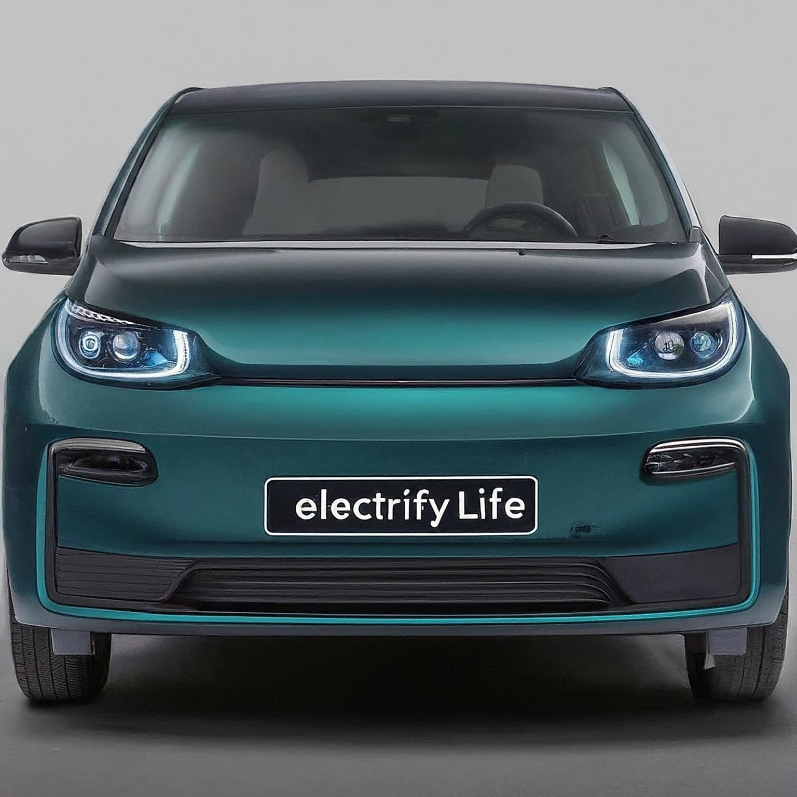
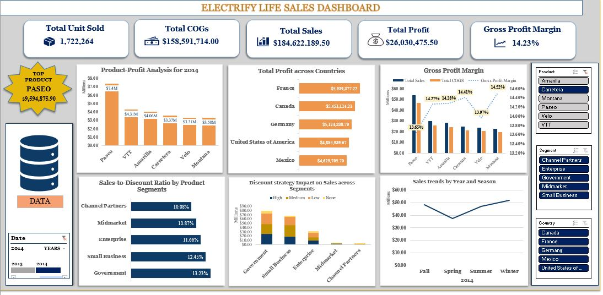

# ELECTRIFY LIFE SALES REPORT (2014) ANALYSIS

## Overview
>Electrify Life is a fictional car battery manufacturing company. The dataset describes all the sales information for the year 2014. The dataset provides all the information required to delve into the company's sale performance, and important metrics for analysis.
## Aim
This project aims to understand sales and financial performance of the company. 
## Objective
The objective of this analysis is to generate a comprehensive overview of the financial health of Electrify Life by examining the sales performance, identify trends, and assess the effectiveness of discount strategies on sales volume.

## Dataset
**Data Source:** [Company Financials Dataset] (https://www.kaggle.com/datasets/atharvaarya25/financials)

The original dataset consists of 16 columns and 1401 rows, which was further manipulated and now consists of 17 columns and 1401 rows offering a comprehensive view of the sales data. 
>The key fields include Segment, Country, Product, Discount Band, Units Sold, Manufacturing Price, Sale Price, Gross Sales, Discounts, Net Sales, COGS (Cost of Goods Sold), and Profit.

## Methodology
1. Data Cleaning and Transformation: The dataset was duplicated and a copy was loaded into Micrsoft Excel for Analysis and Data Visualisation.
2. Data Visualization: Different visualizations such as column charts, bar charts, etc were employed to visualize trends and derive actionable insights.
3. Exploratory Analysis: It was used to identify general sales patterns in the data.

## Data Analytics Tools
**Microsoft Excel**

## Data Visualization

## Key Insights
1.	1,722,264 total units were sold.
2.	Total Cost of Goods sold is $158,591,714.00.
3.	A total sales of $184,622,189.50 was made.
4.	A total profit of $26,030,475.50 with 14.23% profit margin was made.
5.	The product 'Paseo' generated the highest revenue.
6.	France made the most profit.

## Conclusion
This analysis has provided key and valuable insights into Electrify Life sales. It was discovered that:
1.	There is a positive relationship between discount rates and sales volume in all segments. 
2.	Paseo had higher discount rate which resulted in increased sales volume. Montana and Carretera have the highest gross profit margins.
3.	France and Canada showed the highest profitability of sales.
4.	The winter months experienced an uptick in sales whereas there was drastic drop in sales during spring.

## Recommendation
Based on the findings of this analysis, the following recommendations are suggested:
1.	It is recommended that the company develop well-tailored marketing strategies for each season to optimize sales especially in the spring months. Seasonal promotions can also be introduced to stimulate sales volume. 
2.	 To further optimize the gross profit margin, the company should review and adjust pricing and discount strategies regularly.
